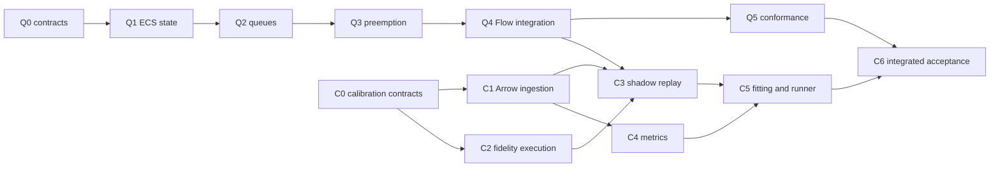

# Kairos: DES primitives and empirical calibration

**Planning baseline:** 2026-09-25; Kairos
`fae901558f07b7b717a676adbafbe2cdc78dea1c`.
**Status:** specifications and plans proposed; implementation not started.

## Deliverables

1. [Queue/preemption specification](tracks/des_queue_preemption_20260925/spec.md)
   and [phased plan](tracks/des_queue_preemption_20260925/plan.md).
2. [Calibration/validation specification](tracks/empirical_calibration_20260925/spec.md)
   and [phased plan](tracks/empirical_calibration_20260925/plan.md).

Each track also includes its ownership contract, risks, test matrix and handoff.
These documents coordinate enhancements under existing Kairos owners. They do
not create competing upstream architecture or claim upstream changes are merged.

## Verified source baseline and implications

| Source in Kairos | Observed capability | Planning implication |
| --- | --- | --- |
| `crates/kairo-ecs-des/src/lib.rs` | FIFO `Resource` with a `VecDeque<EntityId>`; capacity counter; `DESContext` owns scheduler/world but no component registry | Add ECS queue/allocation state and Flow dispatch through an additive runtime; retain legacy APIs |
| `crates/kairo-ecs-abm/src/lib.rs` | Separate ABM context, agent behavior dispatch and per-entity streams | Integrate behavior hooks with one authoritative world/clock; do not run DES and ABM copies |
| `crates/kairo-ecs-state/src/lib.rs` | Generational World plus separate type-erased ComponentRegistry; dense component iteration | Validate liveness; explicitly sort semantic iteration; define checkpoint codecs |
| `crates/kairo-ecs-core/src/lib.rs` | Order `(ticks, priority, insertion sequence)`; cancel by EventId; raw schedule permits past timestamps | Preserve ordering; checked Flow admission rejects past commands; use revisions for stale completions |
| `crates/kairo-ecs-rng/src/lib.rs` | Deterministic stream, seed derivation by entity | Version any task/purpose seed derivation; DESContext's ignored seed is not replay evidence |
| `crates/kairo-ecs-arrow/src/lib.rs`, its Cargo manifest, `schemas/arrow/event_log_v1.schema.json` | Event-log schema and custom smoke encoding; no actual Arrow/Parquet dependency | Add true IPC/Parquet support before promising empirical ingestion; preserve event_log.v1 |
| `crates/kairo-ecs-cli/src/lib.rs` | Scenario/seed manifests and smoke runner surfaces | Extend existing runner and manifest versions; do not introduce a second experiment CLI |

Source inspection is evidence for design constraints, not a runtime test result.
Existing `Done` statuses alone do not establish these new capabilities.

## Ownership and minimal adaptations

| Work | Existing upstream owner | Proposed adaptation |
| --- | --- | --- |
| Queue, allocations, interruptions, Flow and fidelity lifecycle | 03 | Additive modules/runtime in DES; coordinated ABM hooks |
| Scheduler/types/state/RNG contracts | 01 | Review shared handles, replay and purpose-specific seeds; changes only where a concrete need requires them |
| Actual Arrow IO, versioned sidecar streams | 04 | Optional IPC/Parquet features; reuse canonical schema |
| Calibration algorithms, validity and uncertainty | 21 | One reusable Rust calibration crate, contingent on C0 ADR |
| Trace runner, candidate runs, manifests, CLI | 22 | Extend existing experiment runner and compatibility parser |
| Reference fixtures, benchmarks | 12 | Add deterministic queue and synthetic empirical suites |
| API/version/toolchain policy | 25, 30 | Review additive surface and current dependency/MSRV compatibility |
| Acceleration and parallel backends | 32, 34, 35 (39 for batch deployment) | Preserve contracts; add workload/conformance cases to their existing plans |

The additive FlowRuntime avoids breaking public `DESContext` struct literals.
A calibration crate is proposed because algorithms must be usable without the
CLI, while the core must remain free of IO/statistics dependencies. These are
small, explicit adaptations to existing owners. No new Git submodule is needed.

## Milestone dependency map

Independent contract, ingestion and pure-metric work can proceed concurrently
with queue work. This describes implementation dependencies, not instructions to
spawn agents or use parallel writers on shared files.

## Parallelism and Apple silicon

Sequential execution is the oracle. Local multicore accelerates independent
replications and parameter candidates first, using isolated state, deterministic
seed assignment and canonical aggregation. Parallel worker completion order must
not affect the search or outputs. Test worker counts 1/2/N and interrupted runs.

Queue ownership is local to one logical process. PDES cross-process resources
require explicit owner/message semantics, nonnegative lookahead analysis and
Track 34 acceptance; an in-memory claim queue must never be shared unsafely across
LPs. Zero-lookahead resource contention is a documented restriction until that
track supports it. Distributed transport follows Track 35, not a separate design.

Track 32's existing Rust wgpu/WGSL route supplies a future Metal target for
batched numeric work (for example residual evaluation). Queue arbitration stays
on the deterministic CPU path initially. Validate actual Apple hardware before
claiming acceleration. Floating-point metric kernels require tolerance and
objective-ranking checks against CPU; exact integer queue traces still require
exact comparison. MLX or a replacement framework requires evidence of a material
benefit and an ADR addressing the Rust-native boundary.

These tracks deliver CPU functionality and backend compatibility fixtures. They
do not mark PDES/GPU/distributed implementations complete. Their owners retain
existing milestones and performance targets, with these workloads added.

## Review and evidence

Resolve the source-reference inconsistencies recorded in
[alignment findings](../docs/kairos-alignment.md) during the relevant owner phase.
In particular, use the actual core contract and Track 21 replay/seed documents;
do not rely on the missing `vvuq-contract.md` reference or the GPU toy fixture's
different ordering.

Review Q0/C0 architecture decisions before implementation. Review every later
phase against its explicit tests, manual verification and handoff. The final
acceptance demonstration uses synthetic ED data with known parameters and
interruptions; empirical deployment suitability needs separate domain evidence.

## General framework and staged domain adoption

See [the roadmap](roadmap.md): generic ED first, then Cairns ED, followed by the
specified clinical/domain sequence. DES and ABM share core state/time contracts;
future methods extend those contracts through reviewed adapters. Only these two
reusable-engine tracks are detailed here. Preserve public/synthetic generic
fixtures separately from local CHHHS data mappings and calibration profiles.
