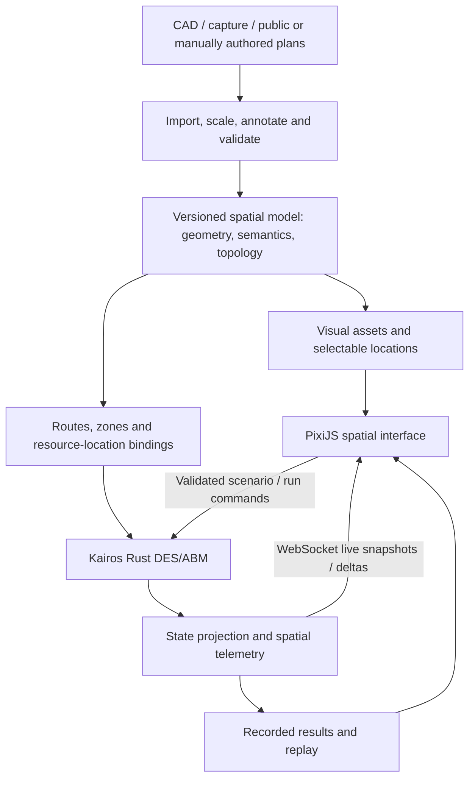

# Later spatial capture, floor-plan and live visualization capability

User requirement recorded 2026-09-27. Planned follow-on capability associated with
E5, following the native generic ED baseline. Initial synthetic route graphs
remain sufficient for early model development. Capture hardware, private site
plans and production CAD import are not prerequisites for D0/P0 or native delivery.

## Shared spatial contract

One versioned package supplies both consumers, with stable location/room/door/
route IDs, floor levels, units, scale, origin, axes and coordinate transforms.
Retain capture/source revision, hashes, converter version, licence/access and
uncertainty; record manual semantic annotation and review. Visual and simulation
artifacts must identify the same package revision and reject mismatches.

SVG, GeoJSON and glTF are candidate interchange/adaptation surfaces, not three
mandatory interchangeable runtime schemas. Freeze a minimal supported format set
when implementing the capability. Use an explicit local metric coordinate frame
for canonical indoor geometry. RFC 7946 GeoJSON uses WGS84 longitude/latitude;
export via a documented georeferencing transform when available, and do not label
arbitrary indoor metre coordinates as conformant GeoJSON.
A glTF/3D adapter is a later extension where useful, not a promise that the initial
PixiJS view is a 3D renderer. CAD/capture tool selection and dependencies are
reviewed and pinned at implementation time.

Visual shapes alone cannot define walkability, valid door connections, access
restrictions or operational locations. Build and validate a semantic layer and
route graph with metric distances, clear connectivity and deterministic routing
ties. Bind clinical resources/site policies separately. Validate scale against
known distances and routes against reviewed topology. Preserve uncertainty in
captured geometry instead of inferring calibrated movement speeds from it.

Use the same package for both display and route computation. Display-only
decoration/interpolation must never change backend topology or resource state.
Layout edits produce a new reviewed revision for a new run; mid-run topology
mutation is unsupported until its own deterministic transition contract exists.

## Replay first; later native WebSocket state sync

Kairos owns simulation time, entity state, routing progress and resource decisions.
PixiJS provides real-time display, optionally interpolating recorded route progress.
Simulation may run paused, slower or faster than wall time; playback pacing is
separate. Reuse upstream Track 05 snapshots and existing runner commands; the
WebSocket transport adapter belongs to the application boundary, not the scheduler.
An optional Wasm/worker execution profile retains separate parity qualification.

Freeze a versioned protocol including run/incarnation ID, schema version, layout
revision/hash, snapshot sequence/base sequence, exact entity IDs and virtual ticks.
Encode wide integers losslessly. Send an initial full snapshot followed by deltas;
detect gaps/stale runs and request a fresh snapshot on reconnect. State explicitly
which display updates may be coalesced under backpressure; retain lossless backend
event/analysis logs. Bound queues, message sizes and client resource use.

Commands require stable IDs, validation, acknowledgement/rejection and duplicate
suppression. Assign their effective simulation tick/order in the backend and record
it for replay. Display callbacks never mutate ECS state directly. Client disconnect
or slow rendering must not change model results; run cancellation/pause requires
an explicit accepted command. Local service exposure is the initial profile;
remote access requires reviewed authentication, origin/access controls, transport
security and data disclosure boundaries before enablement.

## Delivery and verification

- P2/P4 maintain spatial provenance, semantic input schemas and synthetic/public
  layout fixtures. Native C2/E2 routing already consumes their deterministic graph.
- E5 first freezes the layout/snapshot/command contracts and delivers a PixiJS view
  from recorded native-run outputs first. Start with a small synthetic layout;
  add the WebSocket live profile subsequently when useful.
- Full spatial capture/CAD adapters follow as separately bounded E5 follow-on
  packets after format/sample review. They are not required to declare the initial
  dashboard usable; record their own unimplemented/qualified status explicitly.
- Review reusable spatial/binding changes with upstream owners; parent owns CAD
  conversion orchestration, site mappings, web service and presentation. Rust-native
  simulation/module requirements remain; external authoring tools are evaluated
  separately. No later clinical-domain tracks are introduced.

Acceptance fixtures: wrong units/scale/axes, disconnected doors, inaccessible paths,
multiple floors, malformed assets, duplicate IDs and geometry revision mismatch;
known-distance route with matching visual endpoints; lossless tick/ID transport;
missing/out-of-order/stale deltas, reconnect, duplicate commands and slow clients.
Compare canonical model output hashes with display off and at 30/60 FPS. A spatial
change may intentionally alter results; rendering the same spatial revision may not.
Measure command/snapshot latency, memory and transfer costs on declared hardware.
Capture/CAD acceptance requires reviewed sample conversion and topology evidence;
no actual Cairns drawing, capture, runtime service or renderer is asserted here.

## Review refinement: incorporating and surfacing spatial information

The intended capability is spatial input, model behavior and explanation together.
Users can supply or author a layout, review and correct semantic annotations,
associate resources/activities with locations, run a scenario, and inspect where
movement, waiting and resource use occur. Generic/public or synthetic layouts
come first; a later Cairns profile supplies separately reviewed geometry/mappings.

Separate three linked layers under one package revision:

1. Physical geometry: boundaries, doors, corridors, levels and optional landmarks.
2. Semantic/topological model: room functions, connections, direction/access rules,
   route distances, origins/destinations and resource-location bindings. Geometry
   alone cannot establish clinical function, capacity, travel time or concurrency.
3. Scenario state: occupancy, staff/patient/task locations, queues, assignments,
   availability and work/transit/wait intervals owned by the simulation.

P0/E0 define only the minimal location IDs, resource/capacity bindings and optional
route distances needed by the headless model. Full shared geometry/asset/import
schemas are deferred to E5; early inputs need no drawing or renderer. C2/E2
consume topology in Micro mode; Macro may still show locations/occupancy without
inventing routes, intermediate positions or spatial delays. Shared DES/ABM state
and explicit fidelity labels remain required.

E5 must surface selectable rooms/resources/agents with state and provenance,
floor/layer controls, route inspection, and overlays for occupancy, queues,
utilization, travel distance/time and waiting locations where recorded. Unknown
locations remain visibly unknown. Distinguish observed, simulated and interpolated
positions. Explain metric denominators and observation windows; utilization is not
physical crowd density, and an occupancy heatmap alone does not imply congestion
physics or a validated safety threshold. Provide an accessible tabular equivalent.

Use backend telemetry and a shared projection for both live and recorded views.
Replay requires a versioned layout plus sufficient persisted spatial state/events;
scheduler logs alone must not be presumed to contain trajectories. Seeking restores
recorded state or a verified checkpoint/replay path, rather than inventing movement.
Support comparison of versioned layout scenarios with paired seeds, reporting the
applicability limits of geometry, travel-speed and service assumptions.

The WebSocket service carries live updates and commands; versioned static assets
and bulk analysis/replay artifacts can load separately. This prevents repeated
floor-plan transmission and keeps batch/headless analysis useful without a live
connection. Reuse the same IDs, schema and state projection across transports.

Additional acceptance: one named location joins source geometry, route node,
resource, state and exported metric; known-distance transit affects Micro timing;
Macro does not acquire hidden transit costs; overlay totals reconcile with backend
summaries; recording/replay and live view agree at the same simulation tick; display
interpolation never becomes measured output; alternate-layout runs retain explicit
revision/seed provenance. A two-room synthetic fixture proves the full chain before
real capture/CAD adapters. Retain 2D/floor-aware scope initially; 3D and crowd models
remain separately justified extensions.

## Standards checked for this review

- [RFC 7946](https://www.rfc-editor.org/rfc/rfc7946): GeoJSON coordinate semantics;
  supports the explicit georeferencing boundary above.
- [glTF 2.0](https://registry.khronos.org/glTF/specs/2.0/glTF-2.0.html): metre units
  and axis conventions require explicit conversion to the canonical frame.
- [OGC IndoorGML](https://www.ogc.org/standards/indoorgml/): useful reference for
  navigation-oriented indoor modelling. This is not a decision to implement the
  full standard; review semantic compatibility before adopting an adapter.

## MVP scope takes priority

Bed counts, treatment-space capacity, staff/equipment resources, named locations
and minimal routing are already covered by P/E/C model plans. Their implementation
and generic input qualification are pending; no real site configuration is claimed.
This document's visual, CAD and live-display features remain later E5 work. Basic
spatial inputs do not require visible geometry or a full spatial package first.

## CAD and replay refinement

Prefer verified existing CAD where available, preserve the original and layer
manifest, and join geometry to a dated as-operated capacity/capability register.
Drawing accuracy, operational currency and permissions require separate checks.
First later visualization replays completed native runs; live WebSocket control
is a subsequent profile. See [appraisal and qualifications](research/cad-replay-appraisal.md).
