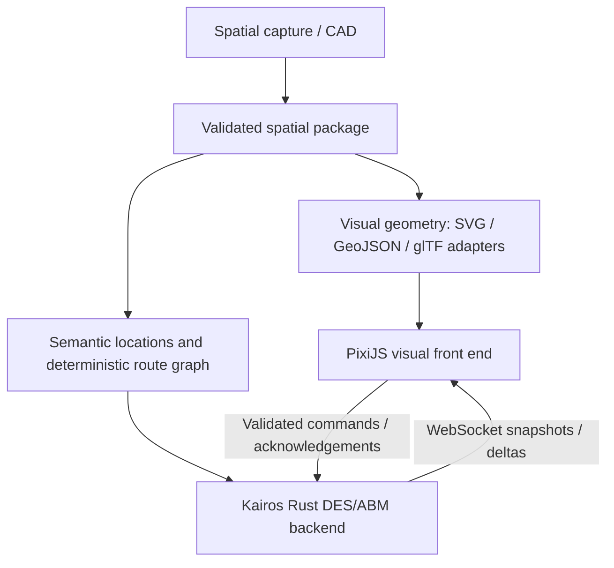

# Later spatial capture, floor-plan and live visualization capability

User requirement recorded 2026-09-27. Planned follow-on capability associated with
E5, following the native generic ED baseline. Initial synthetic route graphs
remain sufficient for early model development. Capture hardware, private site
plans and production CAD import are not prerequisites for D0/P0 or native delivery.

## Shared spatial contract

One versioned package supplies both consumers, with stable location/room/door/
route IDs, floor levels, units, scale, origin, axes and coordinate transforms.
Retain capture/source revision, hashes, converter version, licence/access and
uncertainty; record manual semantic annotation and review. Visual and simulation
artifacts must identify the same package revision and reject mismatches.

SVG, GeoJSON and glTF are candidate interchange/adaptation surfaces, not three
mandatory interchangeable runtime schemas. Freeze a minimal supported format set
when implementing the capability. Specify projected/local coordinates explicitly
for indoor geometry; do not silently reinterpret coordinates as geographic ones.
A glTF/3D adapter is a later extension where useful, not a promise that the initial
PixiJS view is a 3D renderer. CAD/capture tool selection and dependencies are
reviewed and pinned at implementation time.

Visual shapes alone cannot define walkability, valid door connections, access
restrictions or operational locations. Build and validate a semantic layer and
route graph with metric distances, clear connectivity and deterministic routing
ties. Bind clinical resources/site policies separately. Validate scale against
known distances and routes against reviewed topology. Preserve uncertainty in
captured geometry instead of inferring calibrated movement speeds from it.

Use the same package for both display and route computation. Display-only
decoration/interpolation must never change backend topology or resource state.
Layout edits produce a new reviewed revision for a new run; mid-run topology
mutation is unsupported until its own deterministic transition contract exists.

## Native backend and WebSocket state sync

Kairos owns simulation time, entity state, routing progress and resource decisions.
PixiJS provides real-time display, optionally interpolating recorded route progress.
Simulation may run paused, slower or faster than wall time; playback pacing is
separate. Reuse upstream Track 05 snapshots and existing runner commands; the
WebSocket transport adapter belongs to the application boundary, not the scheduler.
An optional Wasm/worker execution profile retains separate parity qualification.

Freeze a versioned protocol including run/incarnation ID, schema version, layout
revision/hash, snapshot sequence/base sequence, exact entity IDs and virtual ticks.
Encode wide integers losslessly. Send an initial full snapshot followed by deltas;
detect gaps/stale runs and request a fresh snapshot on reconnect. State explicitly
which display updates may be coalesced under backpressure; retain lossless backend
event/analysis logs. Bound queues, message sizes and client resource use.

Commands require stable IDs, validation, acknowledgement/rejection and duplicate
suppression. Assign their effective simulation tick/order in the backend and record
it for replay. Display callbacks never mutate ECS state directly. Client disconnect
or slow rendering must not change model results; run cancellation/pause requires
an explicit accepted command. Local service exposure is the initial profile;
remote access requires reviewed authentication, origin/access controls, transport
security and data disclosure boundaries before enablement.

## Delivery and verification

- P2/P4 maintain spatial provenance, semantic input schemas and synthetic/public
  layout fixtures. Native C2/E2 routing already consumes their deterministic graph.
- E5 first freezes the layout/snapshot/command contracts and delivers a PixiJS view
  with a native WebSocket runner profile. Start with a small synthetic layout.
- Full spatial capture/CAD adapters follow as separately bounded E5 follow-on
  packets after format/sample review. They are not required to declare the initial
  dashboard usable; record their own unimplemented/qualified status explicitly.
- Review reusable spatial/binding changes with upstream owners; parent owns CAD
  conversion orchestration, site mappings, web service and presentation. Rust-native
  simulation/module requirements remain; external authoring tools are evaluated
  separately. No later clinical-domain tracks are introduced.

Acceptance fixtures: wrong units/scale/axes, disconnected doors, inaccessible paths,
multiple floors, malformed assets, duplicate IDs and geometry revision mismatch;
known-distance route with matching visual endpoints; lossless tick/ID transport;
missing/out-of-order/stale deltas, reconnect, duplicate commands and slow clients.
Compare canonical model output hashes with display off and at 30/60 FPS. A spatial
change may intentionally alter results; rendering the same spatial revision may not.
Measure command/snapshot latency, memory and transfer costs on declared hardware.
Capture/CAD acceptance requires reviewed sample conversion and topology evidence;
no actual Cairns drawing, capture, runtime service or renderer is asserted here.
